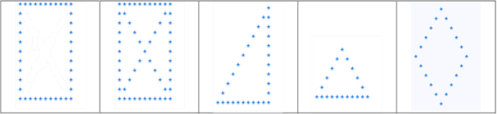

Вывести фигуры посредством изменения условия

```py
count  = 10
for i in range(count):
    for k in range(count):
        if ( k == 0 or i ==count-1 or i==k):
            print("*",end=" ")
        else:
            print(" ",end=" ")
    print("")

```


